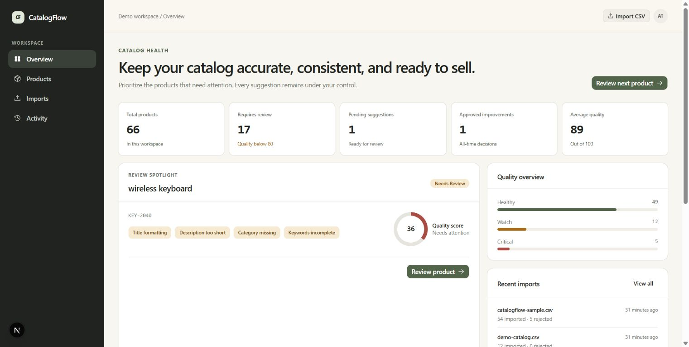
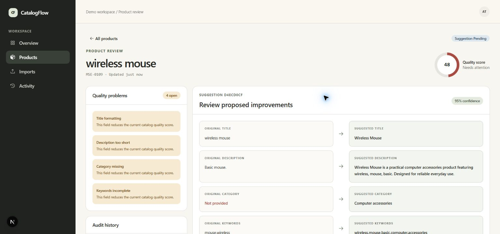
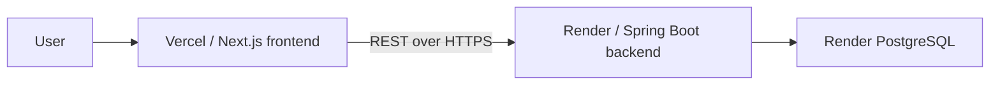
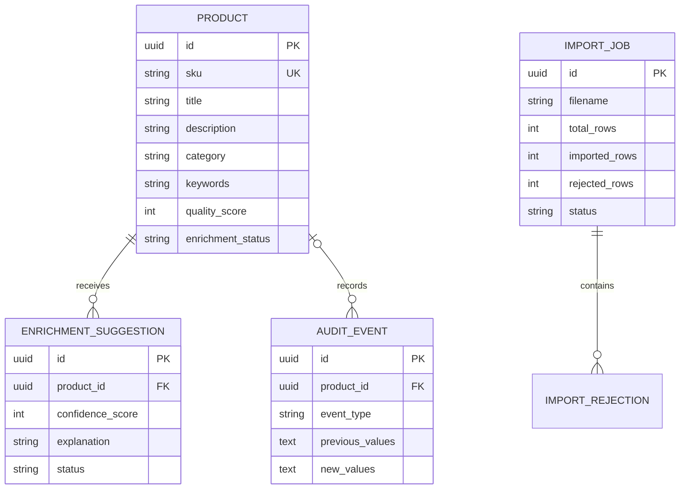

# CatalogFlow

CatalogFlow is a full-stack product catalog enrichment and review platform. It accepts a CSV catalog, validates every row, highlights quality problems, creates deterministic improvement suggestions, and keeps an audit trail when a suggestion is approved or rejected.

The current enrichment engine is deliberately rule-based Java code. It does not use or claim to use artificial intelligence.

## Live demo

- Frontend: deployment in progress
- Backend health: deployment in progress
- Editable Figma design: [CatalogFlow — Product Design](https://www.figma.com/design/Ah0AkKQbQFPlNgFQrmGv56/CatalogFlow-%E2%80%94-Product-Design)

## GitHub repository

[github.com/abdirahman-taabit/catalogflow](https://github.com/abdirahman-taabit/catalogflow)

## Screenshots

| Dashboard | Product review |
| --- | --- |
|  |  |

## Main features

- CSV upload with drag-and-drop, progress, validation, and import summaries
- Required-field and SKU validation with row-level rejection reasons
- Duplicate SKU detection within the file and against saved products
- Searchable, filterable, sortable, and paginated catalog
- Transparent catalog quality score and missing-field indicators
- Deterministic title, description, category, and keyword suggestions
- Side-by-side review with confidence score and rule explanation
- Approval and rejection confirmation flows
- Before-and-after audit history for important actions
- Responsive desktop table and mobile product-card layouts
- Explicit loading, empty, success, and error states

## Technology stack

| Area | Technology |
| --- | --- |
| Frontend | Next.js 16, React 19, TypeScript, Tailwind CSS 4, shadcn/ui |
| Forms and data | React Hook Form, Zod, SWR, TanStack Table |
| Backend | Java 21, Spring Boot 4, Spring Web MVC, Spring Data JPA |
| Database | PostgreSQL 17, Flyway migrations |
| Testing | JUnit 5, Mockito, Testcontainers, Vitest, React Testing Library, Playwright |
| Delivery | GitHub Actions, Vercel, Render, Docker Compose |

## Architecture



The browser only calls the small REST API it needs. Controllers accept HTTP requests, services apply the catalog rules, repositories persist entities, and Flyway owns schema changes. See [docs/architecture.md](docs/architecture.md).

## Database model



## Project structure

```text
catalogflow/
├── apps/
│   ├── web/                 Next.js application and browser/unit tests
│   └── backend/             Spring Boot API, migrations, and tests
├── sample-data/             59-row demonstration catalog
├── design-source/           Approved visual source and Figma handoff assets
├── docs/                    Practical learning guides and screenshots
├── .github/workflows/       Continuous integration
├── docker-compose.yml       Local three-service environment
├── render.yaml              Render backend and database blueprint
└── .env.example             Environment-variable reference
```

## Local setup

Requirements: Node.js 22+, npm, and Java 21+.

Frontend:

```bash
cd apps/web
npm install
npm run dev
```

Backend (uses an embedded H2 file for convenient local development):

```bash
cd apps/backend
./mvnw spring-boot:run
```

Open `http://localhost:3000`. The API runs at `http://localhost:8080`.

## Docker setup

With Docker Desktop running, start PostgreSQL, the backend, and the frontend together:

```bash
docker compose up --build
```

Docker Compose uses PostgreSQL and waits for its health check before starting the API.

## Environment variables

| Variable | Used by | Purpose | Local default |
| --- | --- | --- | --- |
| `NEXT_PUBLIC_API_URL` | Web | Public base URL of the REST API | `http://localhost:8080` |
| `DB_URL` | API local/Docker | Full JDBC connection URL | embedded H2 URL |
| `DB_HOST` | API production | Render PostgreSQL host | none |
| `DB_PORT` | API production | PostgreSQL port | `5432` |
| `DB_NAME` | API production | PostgreSQL database name | none |
| `DB_USERNAME` | API | Database user | `sa` locally |
| `DB_PASSWORD` | API | Database password | empty locally |
| `CORS_ALLOWED_ORIGINS` | API | Comma-separated allowed frontend origins | `http://localhost:3000` |
| `PORT` | API | HTTP port | `8080` |

Copy `.env.example` when running with custom local values. Never commit real credentials.

## Testing commands

```bash
# Frontend checks
cd apps/web
npm run lint
npm run typecheck
npm test
npm run build
npm run test:e2e

# Backend unit tests
cd apps/backend
./mvnw test

# Backend unit + PostgreSQL Testcontainers integration + package
./mvnw verify
```

The Testcontainers integration test skips locally when Docker is unavailable and runs against PostgreSQL in CI.

## Deployment

The Next.js app is deployed from `apps/web` to Vercel. The Spring Boot Docker image and PostgreSQL database are deployed to Render from `render.yaml`. Vercel receives `NEXT_PUBLIC_API_URL`; Render receives its database fields and the Vercel origin for CORS. Detailed steps are in [docs/deployment-guide.md](docs/deployment-guide.md).

## Design decisions

- Graphite navigation, warm-stone surfaces, and muted moss actions match the approved Figma direction.
- Tables are used where comparison matters; mobile uses product cards instead of shrinking the desktop table.
- Quality scoring is explicit and repeatable, so a reviewer can understand why a product needs work.
- Suggestions are reviewable and never update a product until approval.
- The `EnrichmentProvider` interface keeps the current rules simple while leaving a narrow extension point for a future provider.
- H2 makes independent local API startup easy; PostgreSQL remains the production and integration-test database.

## Current limitations

- CatalogFlow is a public portfolio demo without authentication, roles, organizations, or payments.
- Imports are limited to 5 MB and the documented four-column CSV format.
- Suggestions use a small readable keyword-rule set and are English-only.
- Audit values are stored as compact JSON text for readability rather than queried as analytics data.
- The service is designed for demonstration-scale catalogs, not high-volume batch processing.

## Future improvements

- Add downloadable full catalog exports and configurable quality thresholds.
- Add more category rules through configuration rather than code changes.
- Add authenticated workspaces if the product scope grows beyond a public demo.
- Implement another `EnrichmentProvider` that calls an external model, while keeping the deterministic provider available and clearly labeling the source.

## License

[MIT](LICENSE)
