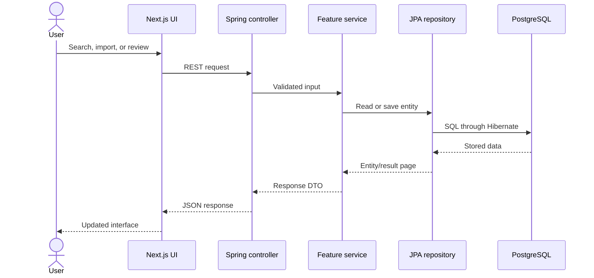

# Architecture

CatalogFlow is one Next.js frontend, one Spring Boot backend, and one PostgreSQL database. It intentionally avoids extra services so the request path is easy to follow.

Controllers only translate HTTP input and output. Services contain the import, quality, enrichment, approval, and dashboard decisions. Repositories use Spring Data JPA. DTOs prevent persistence objects from becoming the public API.

Flyway applies ordered SQL migrations before Hibernate validates the entity mappings. The production profile connects to Render PostgreSQL; the default local profile uses H2 for a low-friction standalone start.

Important writes also call `AuditService`. Approvals store before-and-after values, while imports and rejections store the event details needed by the activity timeline.
